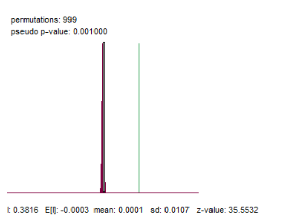

si hay autocorrelacion

Pruebas de hipotesis montecarlo

Queremos saber si el indice de moran es significativo
permutamos y calculamos el indice de moran para muchos 
El histograma es le indice de moran de las permutaciones

H_0 no hay autocorr vs H_1 hay autocorr

nuestra autocorr no es aleatoria

